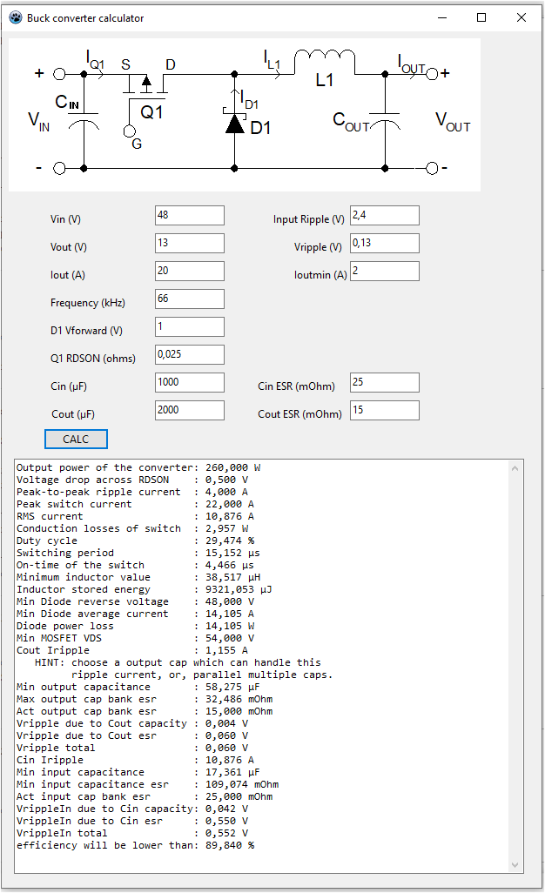

# BuckConvCalc

Hi,

Often, i just need an quick && dirty buck converter (a.k.a step-down) for my projects.

This tools helps calculating the vary basic numbers, RDSON for the switch, minimum ESR values and inductance.
It's not designed to be very accurate, it's more a very fast overview of the possibilities,
given certain params.

The formulas are based on an old Excel file, somewhere avail in the net and later modified to my needs.

This tool is made for the Lazarus IDE, avail for Win, Linux and Mac.
Install the Lazarus IDE plus the current fpc, if you haven't done so.

Delphi should be able to compile as well, there's nothing special in this code.
But i don't have any working Delphi install anymore.

For your convienience, i put the win32 64bit executable here, but you may
easily compile for Linux or MAC, or even build an android one. I use only an Win32/x86_64 one.

Feel free to use it.

--Winfried
